<div align="right">

</div> 

# __Popular Machine Learning Metrics.__

__Introduction-__
Choosing the right metric is crucial while evaluating machine learning (ML) models. Various metrics are proposed to evaluate ML models in different applications, and I thought it may be helpful to provide a summary of popular metrics in a here, for better understanding of each metric and the applications they can be used for. In some applications looking at a single metric may not give you the whole picture of the problem you are solving, and you may want to use a subset of the metrics discussed in this post to have a concrete evaluation of your models.

- __Classification Metrics__ (accuracy, precision, recall, F1-score, ROC, AUC, log-loss)
- __Regression Metrics__ (MSE, MAE, RMSE, Adj R². R²)
- __Ranking Metrics__ (MRR, DCG, NDCG)
- __Statistical Metrics__ (Correlation)
- __Computer Vision Metrics__ (PSNR, SSIM, IoU)
- __NLP Metrics__ (Perplexity, BLEU score)
- __Text Similarity Metrics__ (Jaccard Index, Cosine Similarity)
- __Deep Learning Related Metrics__ (Inception score, Frechet Inception distance)
- __Clustering Metrics__ (Silhouette Score, Dunn’s Index)

---

## 🧲 Part 1: Classification & Regression Evaluation Metrics
```diff
- A metric is different from loss function?

    Loss functions are functions that show a measure of the model performance and are used to train a machine learning 
    model (using some kind of optimization), and are usually differentiable in model’s parameters. On the other hand, 
    metrics are used to monitor and measure the performance of a model (during training, and test), and do not need to 
    be differentiable. However if for some tasks the performance metric is differentiable, it can be used both as a loss 
    function (perhaps with some regularizations added to it), and a metric, such as MSE.
```
<div align="center">
    <h2><b>🦮 Classification Related Metrics</b></h2>
    <i>Models such as support vector machine (SVM), logistic regression, decision trees, random forest, XGboost, convolutional neural network¹, recurrent neural network are some of the most popular classification models.</i>
</div><br>

---

__📌 Confusion Matrix:__

One of the key concept in classification performance is confusion matrix (AKA error matrix), which is a tabular visualization of the model predictions versus the ground-truth labels. Each row of confusion matrix represents the instances in a predicted class and each column represents the instances in an actual class.

<div align="center">
    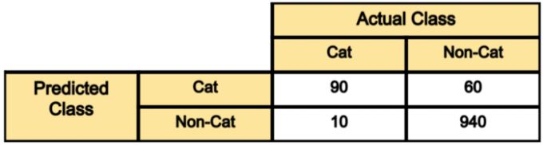
</div>

- __Out of 100 cat images__ the model has predicted 90 of them correctly and has mis-classified 10 of them. If we refer to the “cat” class as positive and the non-cat class as negative class, then 90 samples predicted as cat are considered as as __true-positive__, and the 10 samples predicted as non-cat are __false negative__.
- __Out of 1000 non-cat images__, the model has classified 940 of them correctly, and mis-classified 60 of them. The 940 correctly classified samples are referred as __true-negative__, and those 60 are referred as __false-positive__.

_Another Example-_

<div align="center">
    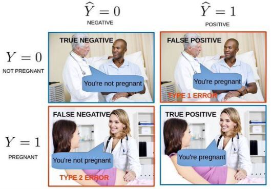
</div>

- _True Positive:_ We predicted positive and it’s true. In the image, we predicted that a woman is pregnant and she actually is.
- _True Negative:_ We predicted negative and it’s true. In the image, we predicted that a man is not pregnant and he actually is not.
- _False Positive (Type 1 Error)_- We predicted positive and it’s false. In the image, we predicted that a man is pregnant but he actually is not.
- _False Negative (Type 2 Error)_- We predicted negative and it’s false. In the image, we predicted that a woman is not pregnant but she actually is.

```python
from sklearn.metrics import confusion_matrix
y_true = ["cat", "ant", "cat", "cat", "ant", "bird"]
y_pred = ["ant", "ant", "cat", "cat", "ant", "cat"]
confusion_matrix(y_true, y_pred, labels=["ant", "bird", "cat"])
```

    Output:
    array([ [2, 0, 0],
            [0, 0, 1],
            [1, 0, 2] ])

---

__📌 Classification Accuracy:__

Classification accuracy is perhaps the simplest metrics one can imagine, and is defined as __the number of correct predictions divided by the total number of predictions__, multiplied by 100. So in the above example, out of 1100 samples 1030 are predicted correctly, resulting in a classification accuracy of:

<div align="center">
    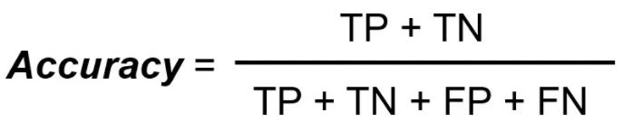
</div>

    Classification accuracy = (90+940)/(1000+100)
                            = 1030/1100
                            = 93.6%

```python
from sklearn.metrics import confusion_matrix, accuracy_score
threshold=0.5
preds_list = preds_list >= threshold
tn, fp, fn, tp = confusion_matrix(labels_list, preds_list).ravel()
accuracy = accuracy_score(labels_list, preds_list
```

---

__📌 Precision:__

There are many cases in which classification accuracy is not a good indicator of your model performance. One of these scenarios is when your class distribution is imbalanced (one class is more frequent than others). In this case, even if you predict all samples as the most frequent class you would get a high accuracy rate, which does not make sense at all (because your model is not learning anything, and is just predicting everything as the top class). For example in our cat vs non-cat classification above, if the model predicts all samples as non-cat, it would result in a 1000/1100= 90.9%. 

__Precision = True_Positive/ (True_Positive+ False_Positive)__

<div align="center">
    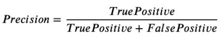
</div>

    Precision_cat = samples correctly predicted cat/samples predicted as cat 
                  = 90/(90+60) 
                  = 60%
    Precision_NonCat = 940/950
                     = 98.9%

```python
from sklearn.metrics import precision_score
y_true = [0, 1, 1, 0, 1, 0]
y_pred = [0, 0, 1, 0, 0, 1]
precision_score(y_true, y_pred)
```
    output:
    0.5

---

__📌 Recall:__

Recall is another important metric, which is defined as the fraction of samples from a class which are correctly predicted by the model.

__Recall = True_Positive/ (True_Positive+ False_Negative)__
    
<div align="center">
    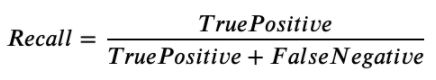
</div>

    Recall_cat = 90/100
               = 90%
    Recall_NonCat = 940/1000
                  = 94%

```python
from sklearn.metrics import recall_score
y_true = [0, 1, 1, 0, 1, 0]
y_pred = [0, 0, 1, 0, 0, 1]
recall_score(y_true, y_pred)
```
    output:
    0.333333

---

__📌 F1 Score:__

Depending on application, you may want to give higher priority to recall or precision. But there are many applications in which both recall and precision are important. Therefore, it is natural to think of a way to combine these two into a single metric. One popular metric which __combines precision and recall is called F1-score__, which is the harmonic mean of precision and recall

__F1-score= 2*Precision*Recall/(Precision+Recall)__

<div align="center">
    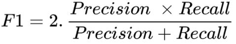
</div>

    F1_cat = 2*0.6*0.9/(0.6+0.9)
           = 72%

```python
from sklearn.metrics import f1_score
y_true = [[0, 0, 0], [1, 1, 1], [0, 1, 1]]
y_pred = [[0, 0, 0], [1, 1, 1], [1, 1, 0]]
f1_score(y_true, y_pred, average=None)
```
    output:
    array([0.66666667, 1. , 0.66666667])

__Precision/Recall Trade-off:__ If you want to make the precision too high, you would end up seeing a drop in the recall rate, and vice versa. _This is called Precision/Recall Trade-off._

```python
from sklearn.metrics import precision_recall_curve
precisions, recalls, thresholds = precision_recall_curve(y_true, y_predicted)
plt.plot(thresholds, precisions[:-1], "b--", label="Precision")
plt.plot(thresholds, recalls[:-1], "g-", label="Recall")
plt.show()
```

<div align="center">
    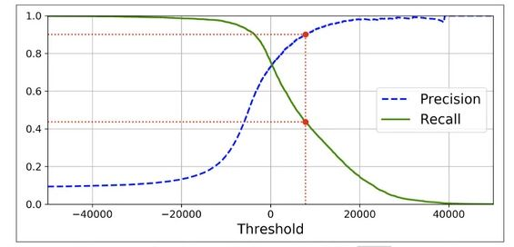
</div>

_Note: As you can see as the threshold increases precision increases but at the cost of recall. From this graph, one can pick a suitable threshold as per their requirements._

---

__📌 Sensitivity and Specificity:__
Sensitivity and specificity are two other popular metrics mostly used in medical and biology related fields which are very sensitive to the data.

__Sensitivity = Recall = TP/(TP+FN)__

__Specificity = True Negative Rate = TN/(TN+FP)__

---

__📌 ROC Curve:__
The receiver operating characteristic curve is plot which shows the performance of a binary classifier as function of its cut-off threshold. It essentially shows the __true positive rate (TPR) against the false positive rate (FPR)__ for various threshold values.

- Many of the classification models are probabilistic, i.e. they predict the probability of a sample being a cat. They then compare that output probability with some cut-off threshold and if it is larger than the threshold they predict its label as cat, otherwise as non-cat. 
- As an example your model may predict the below probabilities for __4 sample images: [0.45, 0.6, 0.7, 0.3]__. Then depending on the __threshold values__ below, you will get different labels:

        cut-off= 0.5: predicted-labels= [0,1,1,0] (default threshold)
        cut-off= 0.2: predicted-labels= [1,1,1,1]
        cut-off= 0.8: predicted-labels= [0,0,0,0]

        ROC curve essentially finds out the TPR and FPR for various threshold values and plots TPR against the FPR

<div align="center">
    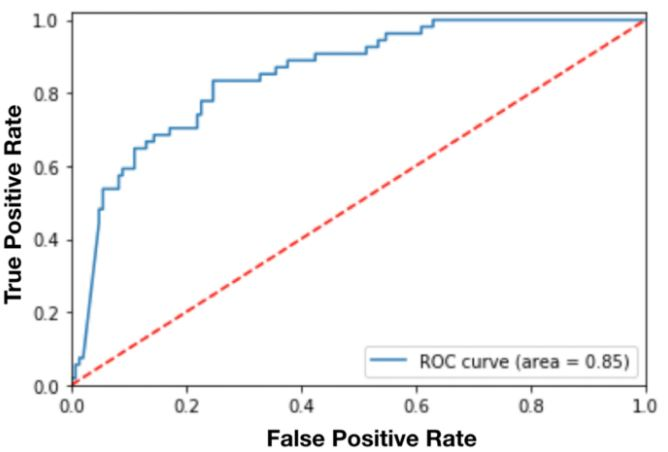
</div>

- From figure, the lower the cut-off threshold on positive class, the more samples predicted as positive class, i.e. higher true positive rate (recall) and also higher false positive rate (corresponding to the right side of this curve). Therefore, there is a trade-off between how high the recall could be versus how much we want to bound the error (FPR).

```python
from sklearn.metrics import roc_auc_score 
roc_auc = roc_auc_score(labels, predictions)
fpr, tpr, thresholds = metrics.roc_curve(y, scores, pos_label=2)
import matplotlib.pyplot as plt
plt.plot(fpr,tpr)
plt.show()
```

---

__📌 AUC:__

The __Area Under the Curve (AUC)__, is an aggregated measure of performance of a binary classifier on all possible threshold values (and therefore it is threshold invariant). AUC calculates the area under the ROC curve, and therefore it is between 0 and 1. One way of interpreting AUC is as the probability that the model ranks a random positive example more highly than a random negative example

<div align="center">
    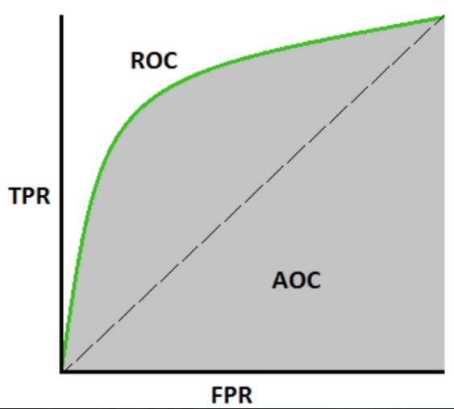
</div>

- On high-level, the higher the AUC of a model the better it is. But sometimes threshold independent measure is not what you want, e.g. you may care about your model recall and require that to be higher than 99% (while it has a reasonable precision or FPR). In that case, you may want to tune your model threshold such that it meets your minimum requirement on those metrics (and you may not care even if you model AUC is not too high).
- Therefore in order to decide how to evaluate your classification model performance, perhaps you want to have a good understanding of the business/problem requirement and the impact of low recall vs. low precision, and decide what metric to optimize for.
- From a practical standpoint, a classification model which outputs probabilities is preferred over a single label output, as it provides the flexibility of tuning the threshold such that it meets your minimum recall/precision requirements. Not all models provide this nice probabilistic outputs though, e.g. SVM does not provide a simple probability as an output (although it provides margin which can be used to tune the decision, but it is not as straightforward and interpretable as having output probabilities).

```python
import numpy as np
from sklearn import metrics
y = np.array([1, 1, 2, 2])
pred = np.array([0.1, 0.4, 0.35, 0.8])
fpr, tpr, thresholds = metrics.roc_curve(y, pred, pos_label=2)
metrics.auc(fpr, tpr)
```

---

__📌 Log Loss:__

__Log loss (Logistic loss) or Cross-Entropy Loss__ is one of the major metrics to assess the performance of a classification problem.

- There is an minor issue with AUC ROC, it only takes into account the order of probabilities and hence it does not take into account the model’s capability to predict higher probability for samples more likely to be positive. In that case, we could us the log loss which is nothing but negative average of the log of corrected predicted probabilities for each instance.
- So, lower the log loss, better the model. However, there is no absolute measure on a good log loss and it is use-case/application dependent.

<div align="center">
    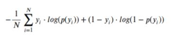
</div>

    p(yi)   = predicted probability of positive class
    1-p(yi) = predicted probability of negative class
    yi      = 1 for positive class and 0 for negative class (actual values)

```python
from sklearn.metrics import log_loss
log_loss(["spam", "ham", "ham", "spam"], [[.1, .9], [.9, .1], [.8, .2], [.35, .65]])
# accuracy = log_loss(y_test, pred)
```

---

__📌 Kolomogorov Smirnov chart:__

__K-S__ or __Kolmogorov-Smirnov__ chart measures performance of classification models. More accurately, K-S is a measure of the degree of separation between the positive and negative distributions. The K-S is 100, if the scores partition the population into two separate groups in which one group contains all the positives and the other all the negatives.

- We can also plot the %Cumulative Good and Bad to see the maximum separation. The metrics covered till here are mostly used in classification problems. Till here, we learnt about confusion matrix, lift and gain chart and kolmogorov-smirnov chart.

<div align="center">
    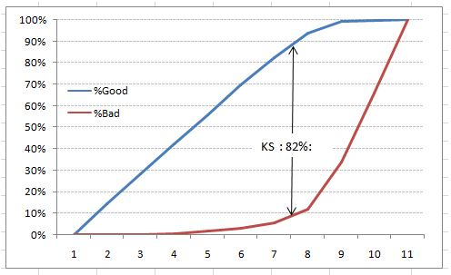
</div>

```python
import pandas as pd
from scipy.stats import ks_2samp

df = pd.read_csv('DummyData.csv') # Dummy example
data1 = df.iloc[:,0]
data2 = df.iloc[:,1]
test = ks_2samp(data1,data2)
print(test)
```

    Output:
    Ks_2sampResult(statistic=0.16666666666666663, pvalue=0.7600465102607566)

---

__📌 Gini Coefficient:__

__Gini coefficient__ is sometimes used in classification problems. Gini coefficient can be straigh away derived from the AUC ROC number. Gini is nothing but ratio between area between the ROC curve and the diagnol line & the area of the above triangle.
    
__Gini = (2 * AUC) – 1__

- Gini above 60% is a good model.

```python
from typing import List
from itertools import combinations
import numpy as np

def gini(x: List[float]) -> float:
    x = np.array(x, dtype=np.float32)
    n = len(x)
    diffs = sum(abs(i - j) for i, j in combinations(x, r=2))
    return diffs / (2 * n**2 * x.mean())
```

---

__📌 Concordant – Discordant ratio:__

Use case: we have 3 students who have some likelihood to pass this year.

    Following are our predictions :
    A – 0.9
    B – 0.5
    C – 0.3

    if we were to fetch pairs of two from these three student then,
    AB , BC, CA

The concordant pair is where the probability of responder was higher than non-responder. Whereas discordant pair is where the vice-versa holds true.
    
    AB  – Concordant
    BC  – Discordant

_Note: Concordant ratio of more than 60% is considered to be a good model. This metric generally is not used when deciding how many customer to target etc. It is primarily used to access the model’s predictive power. For decisions like how many to target are again taken by KS / Lift charts._

---

<div align="center">
    <h2><b>📈 Regression Related Metrics</b></h2>
    <i>Regression models are another family of machine learning and statistical models, which are used to predict a continuous target values.</i>
</div><br>

---

__📌 MSE:__

__Mean squared Error__ is perhaps the most popular metric used for regression problems. It essentially finds the average squared error between the predicted and actual values. It represents the squared distance between actual and predicted values. we perform squared to avoid the cancellation of negative terms and it is the benefit of MSE.

<div align="center">
    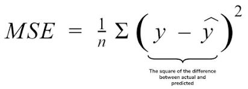
</div>

```python
from sklearn.metrics import mean_squared_error
print("MSE",mean_squared_error(y_test,y_pred))
```

- Advantages of MSE:
    - The graph of MSE is differentiable, so you can easily use it as a loss function.

- Disadvantages of MSE:
    - The value you get after calculating MSE is a squared unit of output. for example, the output variable is in meter(m) then after calculating MSE the output we get is in meter squared.
    - If you have outliers in the dataset then it penalizes the outliers most and the calculated MSE is bigger. So, in short, It is not Robust to outliers which were an advantage in MAE.

---

__📌 MAE:__

__Mean Absolute Error__ _(mean absolute deviation)_ is another metric which finds the average absolute distance between the predicted and target values. __MAE is known to be more robust to the outliers than MSE.__ The main reason being that in MSE by squaring the errors, the outliers (which usually have higher errors than other samples) get more attention and dominance in the final error and impacting the model parameters.

find the difference between the actual value and predicted value that is an absolute error but we have to find the mean absolute of the complete dataset. Hence sum all the errors and divide them by a total number of observations And this is MAE. And we aim to get a minimum MAE because this is a loss.

<div align="center">
    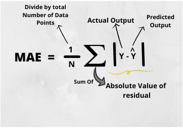
</div>

```python
from sklearn.metrics import mean_absolute_error
print("MAE",mean_absolute_error(y_test,y_pred))
```

- Advantages of MAE:
    - The MAE you get is in the same unit as the output variable.
It is most Robust to outliers.
- Disadvantages of MAE:
    - The graph of MAE is not differentiable so we have to apply various optimizers like Gradient descent which can be differentiable.

---

__📌 RMSE:__

__Root Mean Squared Error__ is clear by the name itself, that it is a simple square root of mean squared error.

<div align="center">
    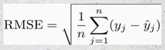
</div>

```python
from sklearn.metrics import mean_squared_error
print("RMSE",np.sqrt(mean_squared_error(y_test,y_pred)))
```

- Advantages of RMSE:
    - The output value you get is in the same unit as the required output variable which makes interpretation of loss easy.
- Disadvantages of RMSE:
    - It is not that robust to outliers as compared to MAE.
    - RMSE is highly affected by outlier values. Hence, make sure you’ve removed outliers from your data set prior to using this metric.

---

__📌 RMSLE:__

__Root Mean Squared Log Error__ Taking the log of the RMSE metric slows down the scale of error. _The metric is very helpful when you are developing a model without calling the inputs._ In that case, the output will vary on a large scale.

<div align="center">
    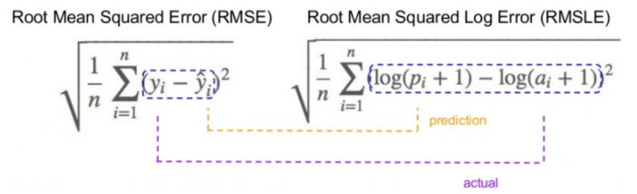
</div>

```python
from sklearn.metrics import mean_squared_log_error
mean_squared_log_error(y_true, y_pred)
```
- RMSLE is usually used when we don’t want to penalize huge differences in the predicted and the actual values when both predicted and true values are huge numbers.

        - If both predicted and actual values are small: RMSE and RMSLE are same.
        - If either predicted or the actual value is big: RMSE > RMSLE
        - If both predicted and actual values are big: RMSE > RMSLE (RMSLE becomes almost negligible)
---

__📌 R Squared (R²):__ _(coefficient of determination)_

R2 score is a metric that tells the performance of your model, not the loss in an absolute sense that how many wells did your model perform.

<div align="center">
    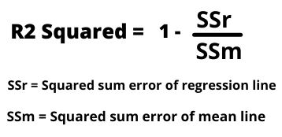
</div>

```python
from sklearn.metrics import r2_score
r2 = r2_score(y_test,y_pred)
print(r2)
```

- If the R2 score is zero then the above regression line by mean line is equal means 1 so 1-1 is zero. So, in this case, both lines are overlapping means model performance is worst, It is not capable to take advantage of the output column.
- when the R2 score is 1, it means when the division term is zero and it will happen when the regression line does not make any mistake, it is perfect. In the real world, it is not possible.

---

__📌 Adjusted R Squared:__

The disadvantage of the R2 score is while adding new features in data the R2 score starts increasing or remains constant but it never decreases because It assumes that while adding more data variance of data increases. But the problem is when we add an irrelevant feature in the dataset then at that time R2 sometimes starts increasing which is incorrect. Hence, To control this situation Adjusted R Squared came into existence.

<div align="center">
    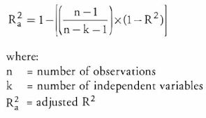
</div>

```python
n = 40
k = 2
adj_r2_score = 1 - ((1-r2)*(n-1)/(n-k-1))
print(adj_r2_score)
```

---

## 🧲 Part 2: Ranking & Statistical Evaluation Metrics

<div align="center">
    <h2><b>📚 Ranking Related Metrics</b></h2>
    <i>Ranking is a fundamental problem in machine learning, which tries to rank a list of items based on their relevance in a particular task (e.g. ranking pages on Google based on their relevance to a given query). </i>
    
    It has a wide range of applications in E-commerce, and search engines:

    - Movie recommendation (as in Netflix, and YouTube),
    - Page ranking on Google,
    - Ranking E-commerce products on Amazon,
    - Query auto-completion,
    - Image search on vimeo,
    - Hotel search on Expedia/Booking.
</div><br>

The algorithms for ranking problem can be grouped into:
- __i) Point-wise models:__ which try to predict a (matching) score for each query-document pair in the dataset, and use it for ranking the items.
- __ii) Pair-wise models:__ which try to learn a binary classifier that can tell which document is more relevant to a query, given pair of documents.
- __iii) List-wise models:__ which try to directly optimize the value of one of the above evaluation measures, averaged over all queries in the training data.

There are various metrics proposed for evaluating ranking problems, such as,

    MRR
    Precision@ K
    DCG & NDCG
    MAP
    Kendall’s tau
    Spearman’s rho

---

__📌 MRR:__

__Mean Reciprocal Rank__ (MRR) is one of the simplest metrics for evaluating ranking models. MRR is essentially the average of the reciprocal ranks of “the first relevant item” for a set of queries Q

<div align="center">
    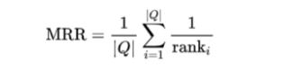
</div>

let’s consider the below example, in which the model is trying to predict the plural form of English words by masking 3 guess. In each case, the correct answer is also given.

<div align="center">
    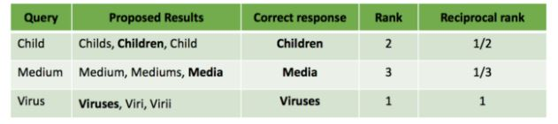
</div>

---

__The MRR of this system can be found as:__
    
    MRR = 1/3 * (1/2+1/3+1/1)
        = 11/18

    Note: One of the limitations of MRR is that, it only takes the rank of one of the items (the most relevant one) into account, and ignores other items (for example mediums as the plural form of medium is ignored). This may not be a good metric for cases that we want to browse a list of related items.

```python
import pandas as pd

gts = pd.DataFrame.from_dict([ {'query': 'q1', 'document': 'doc2'},
                               {'query': 'q1', 'document': 'doc3'},
                               {'query': 'q2', 'document': 'doc7'},])

results = pd.DataFrame.from_dict([ {'query': 'q1', 'document': 'doc1', 'rank': 1},
                                   {'query': 'q1', 'document': 'doc2', 'rank': 2},
                                   {'query': 'q1', 'document': 'doc3', 'rank': 3},
                                   {'query': 'q2', 'document': 'doc4', 'rank': 1},
                                   {'query': 'q2', 'document': 'doc5', 'rank': 2},
                                   {'query': 'q2', 'document': 'doc6', 'rank': 3},])

MAX_RANK = 10000
hits = pd.merge(gts, results, on=["query", "document"], how="left").fillna(MAX_RANK)

MRR = (1 / hits.groupby('query')['rank'].min()).mean()

'''
### -------  Using sklearn library ------- ###
import numpy as np
from sklearn.metrics import label_ranking_average_precision_score
y_true = np.array([[1, 0, 0], [0, 0, 1]])
y_score = np.array([[0.75, 0.5, 1], [1, 0.2, 0.1]])
label_ranking_average_precision_score(y_true, y_score)
'''
```

---

__📌 Precision at k:__

_The number of relevant documents among the top k documents._

<div align="center">
    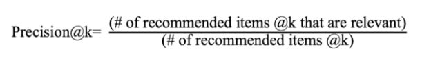
</div>

- As an example, if you search for “hand sanitizer” on Google, and in the first page, 8 out of 10 links are relevant to hand sanitizer, then the P@10 for this query equals to 0.8.
Now to find the precision at k for a set of queries Q, you can find the average value of P@k for all queries in Q.
- P@k has several limitations. Most importantly, it fails to take into account the positions of the relevant documents among the top k. Also it is easy to evaluate the model manually in this case, since only the top k results need to be examined to determine if they are relevant or not.

```python
import numpy as np
from sklearn.metrics import top_k_accuracy_score

y_true = np.array([0, 1, 2, 2])
y_score = np.array([[0.5, 0.2, 0.2],  # 0 is in top 2
                     [0.3, 0.4, 0.2],  # 1 is in top 2
                     [0.2, 0.4, 0.3],  # 2 is in top 2
                     [0.7, 0.2, 0.1]]) # 2 isn't in top 2

print(top_k_accuracy_score(y_true, y_score, k=2))
```
    output: 
    0.75

---

__📌 DCG and NDCG:__

__Normalized Discounted Cumulative Gain (NDCG)__ is perhaps the most popular metric for evaluating learning to rank systems. In contrast to the previous metrics, NDCG takes the order and relative importance of the documents into account, and values putting highly relevant documents high up the recommended lists.

Before giving the official definition NDCG, let’s first introduce two relevant metrics, Cumulative Gain (CG) and Discounted Cumulative Gain (DCG).
<div align="center">
    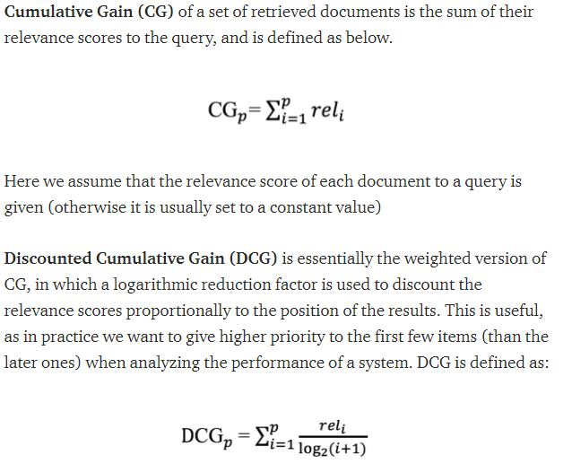
</div>

_Normalized Discounted Cumulative Gain (NDCG)_ tries to further enhance DCG to better suit real world applications. Since the retrieved set of items may vary in size among different queries or systems, NDCG tries to compare the performance using the normalized version of DCG (by dividing it by DCG of the ideal system). In other words, it sorts documents of a result list by relevance, finds the highest DCG (achieved by an ideal system) at position p, and used to normalize DCG

_Note: One of its main limitations is that it does not penalize for bad documents in the result. It may not be suitable to measure performance of queries that may often have several equally good results._

```python
from sklearn.metrics import ndcg_score, dcg_score
import numpy as np
  
true_relevance = np.asarray([[3, 2, 1, 0, 0]])   # Relevance scores in Ideal order
relevance_score = np.asarray([[3, 2, 0, 0, 1]])  # Relevance scores in output order

dcg = dcg_score(true_relevance, relevance_score) # DCG score  
idcg = dcg_score(true_relevance, true_relevance) # IDCG score
ndcg = dcg / idcg                                # Normalized DCG score
  
# Using scikit-learn ndcg_score
print("nDCG score (from function) : ", ndcg_score(true_relevance, relevance_score))
```

---

<div align="center">
    <h2><b>⚔️ Statistical Metrics</b></h2>
    Some of the popular metrics here include: Pearson correlation coefficient, coefficient of determination (R²), Spearman’s rank correlation coefficient, p-value, and more². Here we briefly introduce correlation coefficient, and R-squared
</div><br>

---

__📌Pearson Correlation Coefficient:__

Pearson correlation coefficient is perhaps one of the most popular metrics in the whole statistics and machine learning area. Its application is so broad that is used in almost every aspects of statistical modeling, from feature selection and dimensionality reduction, to regularization and model evaluation.

Correlation coefficient of two random variables (or any two vector/matrix) shows their statistical dependence.

- The correlation coefficient of two variables is always a __value in [-1,1].__ _Two variables are known to be independent if and only if their __correlation is 0.___

```python
import pandas as pd
from scipy.stats import pearsonr
 
df = pd.read_csv("Sample_data.csv")
list1 = df['variable_1']
list2 = df['variable_2']
 
corr, _ = pearsonr(list1, list2)
print('Pearsons correlation: %.3f' % corr)
```

---

## 🧲 Part 3: Computer Vision Evaluation Metrics

<div align="center">
    <h2><b>🧑‍🦳 Computer Vision Metrics</b></h2>
    <i>More recently, with the popularization of the convolutional neural networks (CNN) and GPU-accelerated deep-learning frameworks, object- detection algorithms started being developed from a new perspective. CNNs such as R-CNN, Fast R-CNN, Faster R-CNN, R-FCN, SSD and Yolo have highly increased the performance standards on the field.</i>

    Object detection metrics serve as a measure to assess how well the model performs on an object detection 
    task. It also enables us to compare multiple detection systems objectively or compare them to a benchmark. 
    In most competitions, the average precision (AP) and its derivations are the metrics adopted to assess the
    detections and thus rank the teams.
</div><br>

---

__📌 IoU:__

Guiding principle in all state-of-the-art metrics is the so-called __Intersection-over-Union (IoU) overlap measure__. It is quite literally defined as the intersection over union of the detection bounding box and the ground truth bounding box.

Dividing the area of overlap between predicted bounding box and ground truth by the area of their union yields the Intersection over Union.

__An Intersection over Union score > 0.5 is normally considered a good prediction.__

<div align="center">
    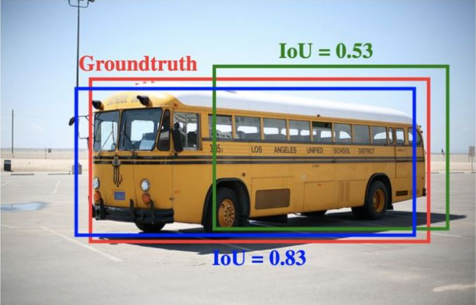
</div>

IoU metric determines how many objects were detected correctly and how many false positives were generated (will be discussed below).

- _True Positives [TP]-_ 
Number of detections with __IoU > 0.5__

- _False Positives [FP]-_ Number of detections with __IoU <= 0.5__ or detected more than once

- _False Negatives [FN]-_ Number of objects that not detected or detected with __IoU <= 0.5__

- _Precision-_ Precision measures how accurate your predictions are. i.e. the percentage of your predictions that are correct.

    Precision = True positive / (True positive + False positive)

- _Recall-_ Recall measures how good you find all the positives. 

    Recall = True positive / (True positive + False negative)

- _F1 Score-_ F1 score is HM (Harmonic Mean) of precision and recall.

<div align="center">
    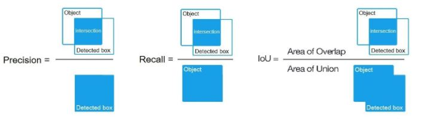
</div>

__i) AP -__ The general definition for the Average Precision(AP) is finding the area under the precision-recall curve.

__ii) mAP -__ The mAP for object detection is the average of the AP calculated for all the classes. mAP@0.5 means that it is the mAP calculated at IOU threshold 0.5.

<div align="center">
    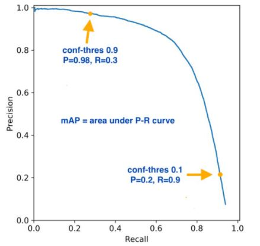
</div>

__iii) mAP Vs other metric -__ The mAP is a good measure of the sensitivity of the neural network. So good mAP indicates a model that's stable and consistent across different confidence thresholds. Precision, Recall and F1 score are computed for given confidence threshold.

- Which metric is more important ?

In general to analyse better performing models, it's advisable to use both validation set (data set that is used to tune hyper-parameters) and test set (data set that is used to assess the performance of a fully-trained model).

    a) On validation set-

    Use mAP to select the best performing model (model that is more stable and consistent) out of all the trained weights across iterations/epochs. Use mAP to understand whether the model should be trained/tuned further or not.

    Check class level AP values to ensure the model is stable and good across the classes. As per use-case/application, if you're completely tolerant to FNs and highly intolerant to FPs then to train/tune the model accordingly use Precision. As per use-case/application, if you're completely tolerant to FPs and highly intolerant to FNs then to train/tune the model accordingly use Recall.

    b) On test set-

    If you're neutral towards FPs and FNs, then use F1 score to evaluate the best performing model.
    
    If FPs are not acceptable to you (without caring much about FNs) then pick the model with higher Precision. If FNs are not acceptable to you (without caring much about FPs) then pick the model with higher Recall

    Once you decide metric you should be using, try out multiple confidence thresholds (say for example - 0.25, 0.35 and 0.5) for given model to understand for which confidence threshold value the metric you selected works in your favour and also to understand acceptable trade off ranges (say you want Precision of at least 80% and some decent Recall). Once confidence threshold is decided, you use it across different models to find out the best performing model.

<div align="center">
    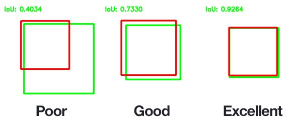
</div>

```python
from collections import namedtuple
import numpy as np
import cv2

Detection = namedtuple("Detection", ["image_path", "gt", "pred"]) # define the `Detection` object

def bb_intersection_over_union(boxA, boxB):
	# determine the (x, y)-coordinates of the intersection rectangle
	xA = max(boxA[0], boxB[0])
	yA = max(boxA[1], boxB[1])
	xB = min(boxA[2], boxB[2])
	yB = min(boxA[3], boxB[3])
	
	interArea = max(0, xB - xA + 1) * max(0, yB - yA + 1) # compute the area of intersection rectangle
	
    # compute the area of both the prediction and ground-truth
	boxAArea = (boxA[2] - boxA[0] + 1) * (boxA[3] - boxA[1] + 1)
	boxBArea = (boxB[2] - boxB[0] + 1) * (boxB[3] - boxB[1] + 1)
	
    # compute the intersection over union by taking the intersection area and dividing it by the sum of prediction + ground-truth areas - the interesection area
	iou = interArea / float(boxAArea + boxBArea - interArea)

	return iou

examples = [
	Detection("image_0002.JPG", [39, 63, 203, 112], [54, 66, 198, 114]),
	Detection("image_0016.JPG", [49, 75, 203, 125], [42, 78, 186, 126]),
	Detection("image_0075.JPG", [31, 69, 201, 125], [18, 63, 235, 135]),
	Detection("image_0090.JPG", [50, 72, 197, 121], [54, 72, 198, 120]),
	Detection("image_0120.JPG", [35, 51, 196, 110], [36, 60, 180, 108])]

for detection in examples:
	image = cv2.imread(detection.image_path) # load the image

	cv2.rectangle(image, tuple(detection.gt[:2]), tuple(detection.gt[2:]), (0, 255, 0), 2)
	cv2.rectangle(image, tuple(detection.pred[:2]), tuple(detection.pred[2:]), (0, 0, 255), 2)
	
	iou = bb_intersection_over_union(detection.gt, detection.pred) # compute the intersection over union and display it
	cv2.putText(image, "IoU: {:.4f}".format(iou), (10, 30), cv2.FONT_HERSHEY_SIMPLEX, 0.6, (0, 255, 0), 2)
	print("{}: {:.4f}".format(detection.image_path, iou))
	cv2.imshow("Image", image) # show the output image
	cv2.waitKey(0)
```

---

__📌 PSNR:__

__Peak signal-to-noise ratio (PSNR)__ is the ratio between the maximum possible power of an image and the power of corrupting noise that affects the quality of its representation. If we have 8-bit pixels, then the values of the pixel channels must be from 0 to 255. By the way, the red, green, blue or RGB color model fits best for the PSNR. PSNR shows a ratio between the maximum possible power of a signal and the power of corrupting noise that affects the fidelity of its representation.

    Input image, specified as scalar, vector, or matrix.
    
    Data Types: single | double | int8 | int16 | int32 | int64 | uint8 | uint16 | uint32 | uint64 | Boolean | fixed point

    Data Types: double

<div align="center">
    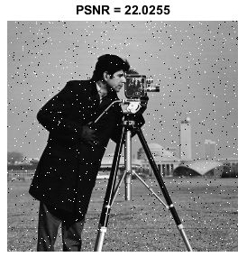
    
</div>

```python
from math import log10, sqrt
import cv2
import numpy as np
  
def PSNR(original, compressed):
    mse = np.mean((original - compressed) ** 2)
    if(mse == 0):  # MSE is zero means no noise is present in the signal .
        # Therefore PSNR have no importance.          
        return 100
    max_pixel = 255.0
    psnr = 20 * log10(max_pixel / sqrt(mse))
    return psnr
  
def main():
     original = cv2.imread("original_image.png")
     compressed = cv2.imread("compressed_image.png", 1)
     value = PSNR(original, compressed)
     print(f"PSNR value is {value})
       
if __name__ == "__main__":
    main()
```

    Output: 
    PSNR value is 43.862955653517126
    
    *Note: Above code and mentioned images are different, demonstrated for just of understanding 

---

__📌 SSIM__

__The Structural Similarity Index (SSIM)__ is a perceptual metric that quantifies the image quality degradation that is caused by processing such as data compression or by losses in data transmission. This metric is basically a full reference that requires 2 images from the same shot, this means 2 graphically identical images to the human eye. The second image generally is compressed or has a different quality, which is the goal of this index.

- SSIM actually measures the perceptual difference between two similar images.
- Generally SSIM values 0.97, 0.98, 0.99 for good quallty recontruction techniques.

<div align="center">
    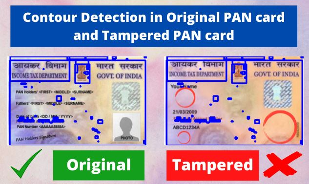
</div>

```python
from skimage.metrics import structural_similarity
import imutils
import cv2
from PIL import Image

original = cv2.imread('pan_card_tampering/image/original.png')
tampered = cv2.imread('pan_card_tampering/image/tampered.png')

# The file format of the source file.
print("Original image format : ",original.format) 
print("Tampered image format : ",tampered.format)
# Image size, in pixels. The size is given as a 2-tuple (width, height).
print("Original image size : ",original.size) 
print("Tampered image size : ",tampered.size)

# Resize Image
original = original.resize((250, 160))
print(original.size)
original.save('pan_card_tampering/image/original.png')#Save image
tampered = tampered.resize((250,160))
print(tampered.size)
tampered.save('pan_card_tampering/image/tampered.png')#Saves image

# Convert the images to grayscale
original_gray = cv2.cvtColor(original, cv2.COLOR_BGR2GRAY)
tampered_gray = cv2.cvtColor(tampered, cv2.COLOR_BGR2GRAY)

(score, diff) = structural_similarity(original_gray, tampered_gray, full=True)
diff = (diff * 255).astype("uint8")
print("SSIM Score is : {}".format(score*100))
if score >= 80:
    print ("The given pan card is original")
else:
    print("The given pan card is tampered")

# Calculating threshold and contours 
thresh = cv2.threshold(diff, 0, 255, cv2.THRESH_BINARY_INV | cv2.THRESH_OTSU)[1]
cnts = cv2.findContours(thresh.copy(), cv2.RETR_EXTERNAL, cv2.CHAIN_APPROX_SIMPLE)
cnts = imutils.grab_contours(cnts)

for c in cnts:
    # applying contours on image
    (x, y, w, h) = cv2.boundingRect(c)
    cv2.rectangle(original, (x, y), (x + w, y + h), (0, 0, 255), 2)
    cv2.rectangle(tampered, (x, y), (x + w, y + h), (0, 0, 255), 2)

#Display original image with contour
print('Original Format Image')
original_contour = Image.fromarray(original)
original_contour.save("demo/original_contour_image.png")
```

    Output: 
    SSIM Score is : 31.678790332739425 
    The given pan card is tampered

---

## 🧲 Part 4: NLP & Text Similarity Metrics Evaluation Metrics

<div align="center">
    <h2><b>📰 NLP Metrics</b></h2>
    <i>Once we have trained the NLP model, we need to evaluate the performance of the model. This article will demonstrate how we can evaluate and assess the accuracy of the NLP model.</i>

    Language generation.
    Image caption generation.
    Text summarization.
    Speech recognition.
</div><br>

---

__📌 BLEU:__

__BLEU / Bilingual Evaluation Understudy__, is a score for comparing a candidate translation of text to one or more reference translations. It _compares the n-grams of the candidate with the n-grams of the reference translation and count the number of matches._ These matches are position-independent. The more the matches, the better the candidate translation is.
- The BLEU metric ranges from __0 to 1.__

```python
from nltk.translate.bleu_score import sentence_bleu, corpus_bleu
reference = [['this', 'is', 'a', 'test'], ['this', 'is' 'test']]
candidate = ['this', 'is', 'a', 'test']
score1 = sentence_bleu(reference, candidate)    # Sentense BLEU Score / output = 1
score2 = corpus_bleu(references, candidates)    # Corpus BLEU Score / output = 1
```

__Cumulative and Individual BLEU Scores__

The BLEU score calculations in NLTK allow you to specify the weighting of different n-grams in the calculation of the BLEU score.

This gives you the flexibility to calculate different types of BLEU score, such as individual and cumulative n-gram scores.

- __Individual N-Gram Scores:__ An individual N-gram score is the evaluation of just matching grams of a specific order, such as single words (1-gram) or word pairs (2-gram or bigram). The weights are specified as a tuple where each index refers to the gram order. To calculate the BLEU score only for 1-gram matches, you can specify a weight of 1 for 1-gram and 0 for 2, 3 and 4 (1, 0, 0, 0)

```python
# 1-gram individual BLEU
from nltk.translate.bleu_score import sentence_bleu
reference = [['this', 'is', 'small', 'test']]
candidate = ['this', 'is', 'a', 'test']
score = sentence_bleu(reference, candidate, weights=(1, 0, 0, 0))
```

- __Cumulative N-Gram Scores:__ Cumulative scores refer to the calculation of individual n-gram scores at all orders from 1 to n and weighting them by calculating the weighted geometric mean. By default, the sentence_bleu() and corpus_bleu() scores calculate the cumulative 4-gram BLEU score, also called BLEU-4.

```python
# 4-gram cumulative BLEU
from nltk.translate.bleu_score import sentence_bleu
reference = [['this', 'is', 'small', 'test']]
candidate = ['this', 'is', 'a', 'test']
score = sentence_bleu(reference, candidate, weights=(0.25, 0.25, 0.25, 0.25))
```

_Another examples:_

```python
# Example 1 - prefect match
from nltk.translate.bleu_score import sentence_bleu
reference = [['the', 'quick', 'brown', 'fox', 'jumped', 'over', 'the', 'lazy', 'dog']]
candidate = ['the', 'quick', 'brown', 'fox', 'jumped', 'over', 'the', 'lazy', 'dog']
score = sentence_bleu(reference, candidate)     # output = 1.0 

# Example 2 - one word different
reference = [['the', 'quick', 'brown', 'fox', 'jumped', 'over', 'the', 'lazy', 'dog']]
candidate = ['the', 'fast', 'brown', 'fox', 'jumped', 'over', 'the', 'lazy', 'dog']
score = sentence_bleu(reference, candidate)     # output = 0.75

# Example 3 - two words different
reference = [['the', 'quick', 'brown', 'fox', 'jumped', 'over', 'the', 'lazy', 'dog']]
candidate = ['the', 'fast', 'brown', 'fox', 'jumped', 'over', 'the', 'sleepy', 'dog']
score = sentence_bleu(reference, candidate)     # output = 0.48

# Example -  all words different
reference = [['the', 'quick', 'brown', 'fox', 'jumped', 'over', 'the', 'lazy', 'dog']]
candidate = ['a', 'b', 'c', 'd', 'e', 'f', 'g', 'h', 'i']
score = sentence_bleu(reference, candidate)     # output = 0.0
```

---

__📌 GLEU: Google-BLEU:__

Suitable for measuring sentence level similarity.

```python
import nltk.translate.gleu_score as gleu

hyp = str('she read the book because she was interested in world history').split()
ref_a = str('she read the book because she was interested in world history').split()
ref_b = str('she was interested in world history because she read the book').split()

score_ref_a = gleu.sentence_gleu([ref_a], hyp)              # output = 1.0
score_ref_b = gleu.sentence_gleu([ref_b], hyp)              # output = 0.78
score_ref_ab = gleu.sentence_gleu([ref_a, ref_b], hyp)      # output = 1.0
```

---

__📌 METEOR:__

__Metric for Evaluation for Translation with Explicit Ordering__ is another metric for machine translation evaluation. The problem with BLEU is that since the BP value uses lengths which are averaged over the entire corpus, so the scores of individual sentences take a hit. _METEOR modifies the precision and recall computations, replacing them with a weighted F-score based on mapping unigrams and a penalty function for incorrect word order._

- The METEOR score allows synonyms and stemmed words to be matched with a reference word.

---

__📌 ROUGE:__

As opposed to the BLEU score, the __Recall-Oriented Understudy for Gisting Evaluation (ROUGE)__ evaluation metric measures the recall. It’s typically used for evaluating the quality of generated text and in machine translation tasks — However, since it measures recall it's mainly used in summarization tasks since it’s more important to evaluate the number of words the model can recall in these types of tasks.

- It works by comparing an automatically produced summary or translation against a set of reference summaries (typically human-produced) _Let's look into below Example_

```python
the cat was found under the bed         # System Summary (what the machine produced)
the cat was found under the bed         # Reference Summary (by humans)
```

<div align="center">
    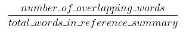
    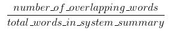
</div>


    Recall = 6/6                                                 Precision = 6/7
           = 1.0                                                           = 0.86

- ROUGE-N, ROUGE-S, and ROUGE-L can be thought of as the granularity of texts being compared between the system summaries and reference summaries.
- __ROUGE-N —__ measures unigram, bigram, trigram and higher order n-gram overlap
- __ROUGE-L —__ measures longest matching sequence of words using LCS.
- __ROUGE-S -__ skip-bigram measures the overlap of word pairs that can have a maximum of two gaps in between words

_For example [ROUGE-N]:_
```python
the cat was found under the bed         # System Summary
the cat was under the bed               # Reference Summary

the cat, cat was, was found, found under, under the, the bed    # System Summary Bigrams
the cat, cat was, was under, under the, the bed                 # Reference Summary Bigrams
```

    ROUGE-2(Recall) = 4/5                    ROUGE-2(Precision) = 4/6
                    = 0.8                                       = 0.67

---

__📌 Perplexity:__

__Perplexity (PPL)__ is an evaluation metric for language models. A lower perplexity indicates a better model. 

<div align="center">
    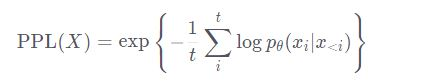
</div>


_Example:_

1) If we weren’t limited by a model’s context size, we would evaluate the model’s perplexity by autoregressively factorizing a sequence and conditioning on the entire preceding subsequence at each step

<div align="center">
    
</div>

2) When evaluating the model’s perplexity of a sequence, a tempting but suboptimal approach is to break the sequence into disjoint chunks and add up the decomposed log-likelihoods of each segment independently.

<div align="center">
    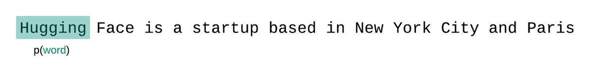
</div>

3) Instead, the PPL of fixed-length models should be evaluated with a sliding-window strategy. This involves repeatedly sliding the context window so that the model has more context when making each prediction.

<div align="center">
    
</div>

---

<div align="center">
    <h2><b>✏️ Text Similarity Metrics</b></h2>
    <i>How similar are these two words?”, “How similar are these two sentences?” , “How similar are these two documents?”.</i>
</div><br>

---

__📌 Jaccard Similarity:__

__Jaccard similarity or intersection over union__ is defined as size of intersection divided by size of union of two sets. 

_Example:_

    Sentence 1: AI is our friend and it has been friendly
    Sentence 2: AI and humans have always been friendly

In order to calculate similarity using Jaccard similarity, we will first perform lemmatization to reduce words to the same root word.

<div align="center">
    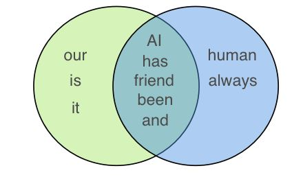
</div>

    Output:
    = 5/(5+3+2) 
    = 0.5

```python
# Function to calculate Jaccard index
def get_jaccard_sim(str1, str2):  
    a = set(str1.split()) 
    b = set(str2.split())
    c = a.intersection(b)
    return float(len(c)) / (len(a) + len(b) - len(c))

'''
def compute_jaccard_similarity_score(x, y):
    intersection_cardinality = len(set(x).intersection(set(y)))
    union_cardinality = len(set(x).union(set(y)))
    return intersection_cardinality / float(union_cardinality)
score = compute_jaccard_similarity_score(np.array([0, 1, 2, 5, 6]), np.array([0, 2, 3, 5, 7, 9]))
'''
```

---

__📌 Cosine Similarity:__

Cosine similarity calculates similarity by measuring the cosine of angle between two vectors. This is calculated as:

<div align="center">
    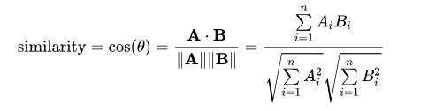
</div>

With cosine similarity, we need to convert sentences into vectors. One way to do that is to use bag of words with either TF (term frequency) or TF-IDF (term frequency- inverse document frequency). The choice of TF or TF-IDF depends on application and is immaterial to how cosine similarity is actually performed. 
    
    - TF is good for text similarity in general, but TF-IDF is good for search query relevance.
    - Another way is to use Word2Vec or our own custom word embeddings to convert words into vectors.

_Example:_

    Sentence 1: AI is our friend and it has been friendly
    Sentence 2: AI and humans have always been friendly

Step 1, we will calculate Term Frequency using Bag of Words:

<div align="center">
    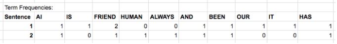
</div>

Step 2, The main issue with term frequency counts shown above is that it favors the documents or sentences that are longer. One way to solve this issue is to normalize the term frequencies with the respective magnitudes or L2 norms. Summing up squares of each frequency and taking a square root, L2 norm of Sentence 1 is 3.3166 and Sentence 2 is 2.6458. Dividing above term frequencies with these norms, we get:

<div align="center">
    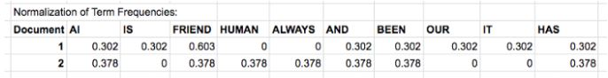
</div>

    Cosine Similarity = (0.302*0.378) + (0.603*0.378) + (0.302*0.378) + (0.302*0.378) + (0.302*0.378) 
                      = 0.684

```python
from collections import Counter
from sklearn.feature_extraction.text import CountVectorizer
from sklearn.metrics.pairwise import cosine_similarity
def get_cosine_sim(*strs): 
    vectors = [t for t in get_vectors(*strs)]
    return cosine_similarity(vectors)
    
def get_vectors(*strs):
    text = [t for t in strs]
    vectorizer = CountVectorizer(text)
    vectorizer.fit(text)
    return vectorizer.transform(text).toarray()
```

---

__📌 WER (Word Error Rate):__

Levenshtein distance (edit distance) for words: minimum number of edits (insertion, deletions or substitutions) required to change the hypotheses sentence into the reference.
Range: greater than 0 (ref = hyp), no max range as Automatic Speech Recognizer (ASR) can insert an arbitrary number of words.

    WER = frac{S+D+I}{N} 
        = frac{S+D+I}{S+D+C}
    
    S: number of substitutions, 
    D: number of deletions, 
    I: number of insertions, 
    C: number of the corrects, 
    N: number of words in the reference ($N=S+D+C$)

    WAcc (Word Accuracy) or Word Recognition Rate (WRR): $1 - WER$

```python
def wer_score(hyp, ref, print_matrix=False):
  N = len(hyp)
  M = len(ref)
  L = np.zeros((N,M))
  for i in range(0, N):
    for j in range(0, M):
      if min(i,j) == 0:
        L[i,j] = max(i,j)
      else:
        deletion = L[i-1,j] + 1
        insertion = L[i,j-1] + 1
        sub = 1 if hyp[i] != ref[j] else 0
        substitution = L[i-1,j-1] + sub
        L[i,j] = min(deletion, min(insertion, substitution))
        # print("{} - {}: del {} ins {} sub {} s {}".format(hyp[i], ref[j], deletion, insertion, substitution, sub))
  if print_matrix:
    print("WER matrix ({}x{}): ".format(N, M))
    print(L)
  return int(L[N-1, M-1])

ref = str('the cat is very cute').split()
hyp = str('the baby cat was cute').split()

wer_score(hyp, ref, print_matrix=True)
```

    output:
    WER matrix (5x5): [ [0. 1. 2. 3. 4.]
                        [1. 1. 2. 3. 4.]
                        [2. 1. 2. 3. 4.]
                        [3. 2. 2. 3. 4.]
                        [4. 3. 3. 3. 3.] ]
                     3

---

## 🧲 Part 5: Deep Learning Evaluation Matrics

<div align="center">
    <h2><b>📚 Evaluation for GAN</b></h2>
    <i>Generative Adversarial Networks, or GANs for short, are an approach to generative modeling using deep learning methods, such as convolutional neural networks.</i>
</div><br>

---

__📌 Inception Score:__

The Inception Score, or __IS__ is an objective metric for evaluating the quality of generated images, specifically synthetic images output by generative adversarial network models. The inception score involves using a pre-trained deep learning neural network model for image classification to classify the generated images. 

- The inception score has a lowest value of 1.0 and a highest value of the number of classes supported by the classification model; in this case, the Inception v3 model supports the 1,000 classes of the ILSVRC 2012 dataset, and as such, the highest inception score on this dataset is 1,000.
- The CIFAR-10 dataset is a collection of 50,000 images divided into 10 classes of objects. The original paper that introduces the inception calculated the score on the real CIFAR-10 training dataset, achieving a result of 11.24 +/- 0.12.
- Using the GAN model also introduced in their paper, they achieved an inception score of 8.09 +/- .07 when generating synthetic images for this dataset.

```python
# calculate inception score with Keras
from math import floor
from numpy import ones
from numpy import expand_dims
from numpy import log
from numpy import mean
from numpy import std
from numpy import exp
from keras.applications.inception_v3 import InceptionV3
from keras.applications.inception_v3 import preprocess_input
 
# assumes images have the shape 299x299x3, pixels in [0,255]
def calculate_inception_score(images, n_split=10, eps=1E-16):
	model = InceptionV3()                                   	# load inception v3 model
	processed = images.astype('float32')                        # convert from uint8 to float32
	processed = preprocess_input(processed)                     # pre-process raw images for inception v3 model
	yhat = model.predict(processed)                             # predict class probabilities for images
	scores = list()                                             # enumerate splits of images/predictions
	n_part = floor(images.shape[0] / n_split)
	for i in range(n_split):
		ix_start, ix_end = i * n_part, i * n_part + n_part      # retrieve p(y|x)
		p_yx = yhat[ix_start:ix_end]
		p_y = expand_dims(p_yx.mean(axis=0), 0)                 # calculate p(y)
		kl_d = p_yx * (log(p_yx + eps) - log(p_y + eps))        # calculate KL divergence using log probabilities
		sum_kl_d = kl_d.sum(axis=1)                             # sum over classes
		avg_kl_d = mean(sum_kl_d)                               # average over images
		is_score = exp(avg_kl_d)
		scores.append(is_score)
	
	is_avg, is_std = mean(scores), std(scores)                  # average across images
	return is_avg, is_std
 
images = ones((50, 299, 299, 3))                    # pretend to load images
print('loaded', images.shape)
is_avg, is_std = calculate_inception_score(images)  # calculate inception score
print('score', is_avg, is_std)

'''
Running the example first defines the 50 fake images, then calculates the inception score on each batch and reports the expected inception score of 1.0, with a standard deviation of 0.0.
'''
```

    Output:
    loaded (50, 299, 299, 3)
    score 1.0 0.0

---

__📌 FID:__

The __Frechet Inception Distance score / FID__ is a metric that calculates the distance between feature vectors calculated for real and generated images. The score summarizes how similar the two groups are in terms of statistics on computer vision features of the raw images calculated using the inception v3 model used for image classification. Lower scores indicate the two groups of images are more similar, or have more similar statistics, with a perfect score being 0.0 indicating that the two groups of images are identical.

```python
# calculate FID score with Keras
import numpy
from numpy import cov
from numpy import trace
from numpy import iscomplexobj
from numpy import asarray
from numpy.random import randint
from scipy.linalg import sqrtm
from keras.applications.inception_v3 import InceptionV3
from keras.applications.inception_v3 import preprocess_input
from keras.datasets.mnist import load_data
from skimage.transform import resize
 
# scale an array of images to a new size
def scale_images(images, new_shape):
	images_list = list()
	for image in images:
		
		new_image = resize(image, new_shape, 0)                     # resize with nearest neighbor interpolation
		images_list.append(new_image)                       
	return asarray(images_list)
 
# calculate frechet inception distance
def calculate_fid(model, images1, images2):
	# calculate activations
	act1 = model.predict(images1)
	act2 = model.predict(images2)

	# calculate mean and covariance statistics
	mu1, sigma1 = act1.mean(axis=0), cov(act1, rowvar=False)
	mu2, sigma2 = act2.mean(axis=0), cov(act2, rowvar=False)

	
	ssdiff = numpy.sum((mu1 - mu2)**2.0)                            # calculate sum squared difference between means
	covmean = sqrtm(sigma1.dot(sigma2))                         	# calculate sqrt of product between cov

	# check and correct imaginary numbers from sqrt
	if iscomplexobj(covmean):
		covmean = covmean.real
	fid = ssdiff + trace(sigma1 + sigma2 - 2.0 * covmean)           # calculate score
	return fid
 
# prepare the inception v3 model
model = InceptionV3(include_top=False, pooling='avg', input_shape=(299,299,3))

# define two fake collections of images
images1 = randint(0, 255, 10*32*32*3)
images1 = images1.reshape((10,32,32,3))
images2 = randint(0, 255, 10*32*32*3)
images2 = images2.reshape((10,32,32,3))
print('Prepared', images1.shape, images2.shape)

# convert integer to floating point values
images1 = images1.astype('float32')
images2 = images2.astype('float32')

# resize images
images1 = scale_images(images1, (299,299,3))
images2 = scale_images(images2, (299,299,3))
print('Scaled', images1.shape, images2.shape)

# pre-process images
images1 = preprocess_input(images1)
images2 = preprocess_input(images2)

# fid between images1 and images1
fid = calculate_fid(model, images1, images1)
print('FID (same): %.3f' % fid)

# fid between images1 and images2
fid = calculate_fid(model, images1, images2)
print('FID (different): %.3f' % fid)
```

    Output:
    Prepared (10, 32, 32, 3) (10, 32, 32, 3)
    Scaled (10, 299, 299, 3) (10, 299, 299, 3)
    FID (same): -0.000
    FID (different): 35.495

---

## 🧲 Part 6: Clusters Evaluation Matrics

<div align="center">
    <h2><b>🎰 Performance Evaluation for clustering</b></h2>
    <i>Clustering is the most common form of unsupervised learning. clusters are evaluated based on some similarity or dissimilarity measure such as the distance between cluster points. If the clustering algorithm separates dissimilar observations apart and similar observations together, then it has performed well.</i>
</div><br>

---

__📌 Silhouette Coefficient:__

The Silhouette Coefficient tells us how well-assigned each individual point. 

- The __score is bounded between -1 for incorrect clustering and +1 for highly dense clustering__. Scores around zero indicate overlapping clusters. The score is higher when clusters are dense and well separated, which relates to a standard concept of a cluster.

<div align="center">
    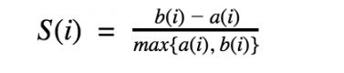
</div>

    The Silhouette Coefficient is defined for each sample and is composed of two scores:
    a: The mean distance between a sample and all other points in the same cluster.
    b: The mean distance between a sample and all other points in the next nearest cluster.
		   
```python
from sklearn.cluster import KMeans
from sklearn.metrics import silhouette_score

kmeans = KMeans(n_clusters = 4, init = "k-means++", max_iter = 300, n_init = 10, random_state = 0)
y_kmeans = kmeans.fit_predict(milage_data_norm)
						    
print(f'Silhouette Score: {silhouette_score(milage_data_norm, y_kmeans)}')
```
						  
---

__📌 Rand Index and Adjusted Rand Index:__						  
		   
 It computes a similarity measure between two clusters by considering all pairs of samples and counting pairs that are assigned in the same or different clusters in the predicted and true clusterings.						  
						  
<div align="center">
    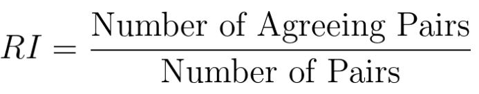
</div>
						    
<div align="center">
    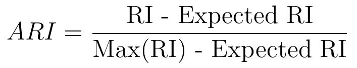
</div>
						    
- The Adjusted Rand Index, similarly to RI, ranges from zero to one, with zero equating to random labelling and one when the clusters are identical.

```python
sklearn.metrics.rand_score(labels_true, labels_pred)
						    
sklearn.metrics.adjusted_mutual_info_score(labels_true, labels_pred, *, average_method='arithmetic')
```
						  
---

__📌 Davies-Bouldin Index__

The Davies-Bouldin Index is defined as the average similarity measure of each cluster with its most similar cluster. Similarity is the ratio of within-cluster distances to between-cluster distances. In this way, clusters which are farther apart and less dispersed will lead to a better score.

- The minimum score is zero, and differently from most performance metrics, the lower values the better clustering performance.					    

```python    
sklearn.metrics.davies_bouldin_score(X, labels)						    
```
						    
---
<div align="left">

</div>
